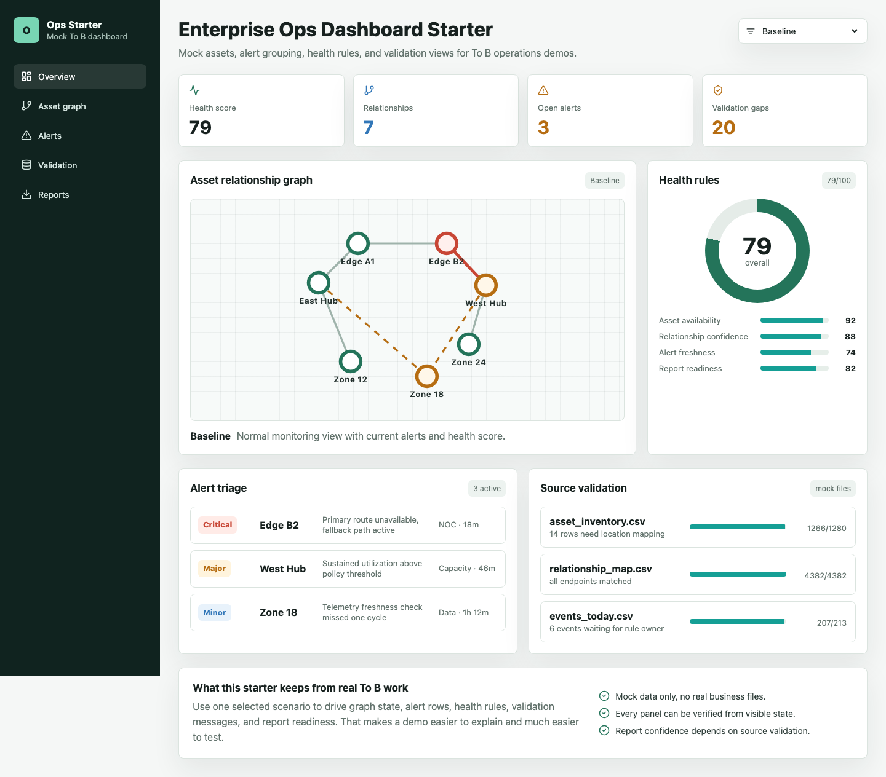
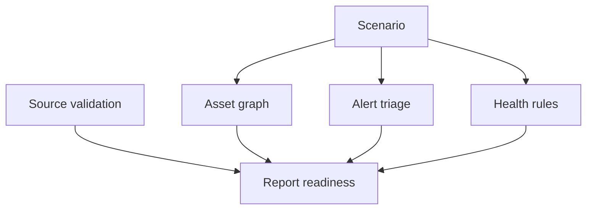

# Enterprise Ops Dashboard Starter

一个完全脱敏的 To B 运维可视化 starter。这里没有真实业务文件，也没有真实截图，只有手写 mock 数据和一套可以复用的前端组织方式。

我做过几类 To B 演示系统以后，发现最值得留下来的经验其实很朴素：关系图、告警、健康度、数据校验、报表状态要能互相解释。页面看起来再完整，如果点一个场景以后只有局部变化，演示的人很难讲清楚系统到底在判断什么。

[运行项目](#-运行项目) · [脱敏说明](docs/01-sanitization.md) · [架构笔记](docs/02-demo-architecture.md) · [验收清单](docs/03-validation-loop.md)



## 🚀 运行项目

```bash
npm install
npm run dev
```

浏览器打开：

```text
http://localhost:5173
```

生产构建：

```bash
npm run build
```

## 这个 repo 里有什么

```text
src/
  main.tsx       主界面、场景切换、面板组合
  mockData.ts    手写 mock 资产、关系、告警、校验数据
  styles.css     To B dashboard 样式

examples/
  mock-assets.json
  mock-validation.json

docs/
  01-sanitization.md
  02-demo-architecture.md
  03-validation-loop.md
```

## 我想分享的点

### 场景要能牵动多个面板

很多 To B demo 会做一个场景下拉框，但场景只影响某一张图。这样演示时会很尴尬：图变了，告警没变，健康度没变，报表状态也没变。

这个 starter 用一个 `scenarioId` 同时驱动：

- 关系图高亮。
- 告警列表过滤。
- 健康度分数变化。
- 校验和报表提示。

真实项目里不一定要写得复杂，但最好让使用方感到系统有一致的判断链。

### 数据校验页不要藏起来

运维类系统经常依赖很多源文件或接口。演示时只给一个漂亮驾驶舱，很容易被问到：这些数字从哪里来，缺的数据怎么处理，报表可信度怎么判断。

我更喜欢把校验结果放到主流程里，让数据来源、匹配数量、缺失数量直接可见。这样后面导出报表、解释告警、追踪资产关系时，都有依据。

### 健康度规则要能被看懂

健康分不能只当装饰数字。页面里至少要能看到几个组成项，比如可用性、关系可信度、告警新鲜度、报表就绪度。分数可以是 mock，但规则结构要像真的。

### 报表状态要跟数据质量相连

很多 demo 的报表按钮只是一个结尾动作。更好的做法是让报表状态受数据校验影响：缺口越多，报表信心越低。这样系统就不只是导出文件，还能解释文件为什么可信。

## 界面结构



## 脱敏原则

这个仓库只保留通用工程方法：

- mock 资产。
- mock 关系。
- mock 告警。
- mock 校验行。
- 通用 To B dashboard 布局。

没有放入：

- 真实业务数据。
- 真实源文件名。
- 真实接口路径。
- 真实截图。
- 真实报表。
- 任何可反推出项目背景的字段。

## 可以怎么改

- 把 `mockData.ts` 换成自己的资产和告警结构。
- 把关系图换成 Cytoscape、D3、ECharts graph 或后端接口。
- 给校验结果接入真实导入任务。
- 把健康度规则拆到配置文件。
- 给报表按钮接入后端导出接口。

## License

MIT
