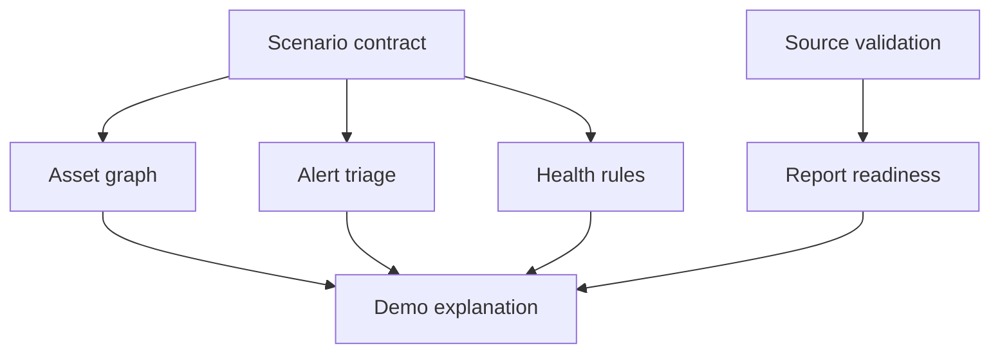

# Enterprise Ops Dashboard Starter

一个 To B 运维可视化 starter，重点放在几条我做企业级 demo 时反复用到的组织方式：场景联动、资产关系、告警解释、健康度规则、数据质量和报表可信度。

很多 dashboard 第一眼挺完整，演示时很快就散了：图是一套逻辑，告警是一套逻辑，健康分是一套逻辑，导出报表又解释不清来源。这个 repo 想保留的是一条更顺的判断链。

[运行项目](#-运行项目) · [可复用模式](docs/04-reusable-patterns.md) · [架构笔记](docs/02-demo-architecture.md) · [验收清单](docs/03-validation-loop.md)


## 🚀 运行项目

```bash
npm install
npm run dev
```

浏览器打开：

```text
http://localhost:5173
```

生产构建和数据合同检查：

```bash
npm run build
npm run check:contract
```

## 可以直接拿走什么

```text
src/
  opsPatterns.ts   场景联动、健康度、报表可信度、合同检查
  mockData.ts      mock 资产、关系、告警、校验数据
  main.tsx         可运行 dashboard
  styles.css       To B dashboard 样式

examples/
  ops-contract.json      完整 mock 数据合同
  mock-assets.json       资产关系样例
  mock-validation.json   数据校验样例

docs/
  02-demo-architecture.md
  03-validation-loop.md
  04-reusable-patterns.md
```

这里最有用的文件是 [src/opsPatterns.ts](src/opsPatterns.ts)。它把 dashboard 里容易散掉的逻辑抽成了几个小函数：

- `alertsForScenario`：根据场景筛告警。
- `calculateRuleScores`：把资产、关系、告警、校验行转成健康度规则。
- `summarizeValidation`：把数据校验行转成报表可信度。
- `validateOpsContract`：检查 mock 合同有没有断链。

## 我踩过的几个点

### 1. 场景要有协议

场景下拉框不能只改标题。一个场景至少要知道自己影响哪些资产，这样关系图、告警列表、健康度、报表状态才能一起变化。

```json
{
  "id": "edge-pressure",
  "name": "Edge Pressure",
  "description": "Highlights one edge asset, related alerts, and downstream services.",
  "impactedAssets": ["edge-2", "hub-west", "zone-2"]
}
```

这个结构很小，但演示时很管用。讲解的人可以从一个场景一路讲到资产、告警、规则和报表。

### 2. 数据质量应该在页面上露出来

To B 系统经常会接各种源文件、接口、人工表。只展示最终指标，使用方很容易追问：缺的数据去了哪里，导出的数字靠不靠谱。

我更喜欢把校验结果放在主界面里：

```json
{
  "source": "asset_inventory.csv",
  "rows": 1280,
  "matched": 1266,
  "missing": 14,
  "note": "14 rows need location mapping"
}
```

这样报表可信度就有来源，缺口也不会被藏起来。

### 3. 健康分要能解释

健康分最好别直接写成一个数字。这个 starter 里用了四个规则：

| 规则 | 解释 |
|---|---|
| Asset availability | 关键资产状态 |
| Relationship confidence | 关系链路是否异常 |
| Alert freshness | 活跃告警数量和等级 |
| Report readiness | 数据校验覆盖率 |

规则可以简单，但要让人看得懂。演示时被问为什么是这个分数，页面自己就能回答一半。

### 4. mock 数据也要验

demo 里很常见的问题是：图上的资产叫 A，告警里写的是 A1，报表里又叫另一个名字。页面能跑，但演示时很容易露馅。

这个 repo 留了一个小检查：

```bash
npm run check:contract
```

它会检查：

- 关系里的 `source` / `target` 是否存在。
- 告警引用的资产名是否存在。
- 校验行里的 `missing` 是否对得上。
- 场景里的影响资产是否存在。

## 页面结构



## 可以怎么改

- 换掉 `examples/ops-contract.json`，接自己的资产、关系和告警。
- 把 `validateOpsContract` 接到 CI，避免 mock 数据断链。
- 把关系图替换成 Cytoscape、D3 或 ECharts graph。
- 把健康度规则拆成后端配置。
- 把 `Report readiness` 接到真实导出接口。

## License

MIT
