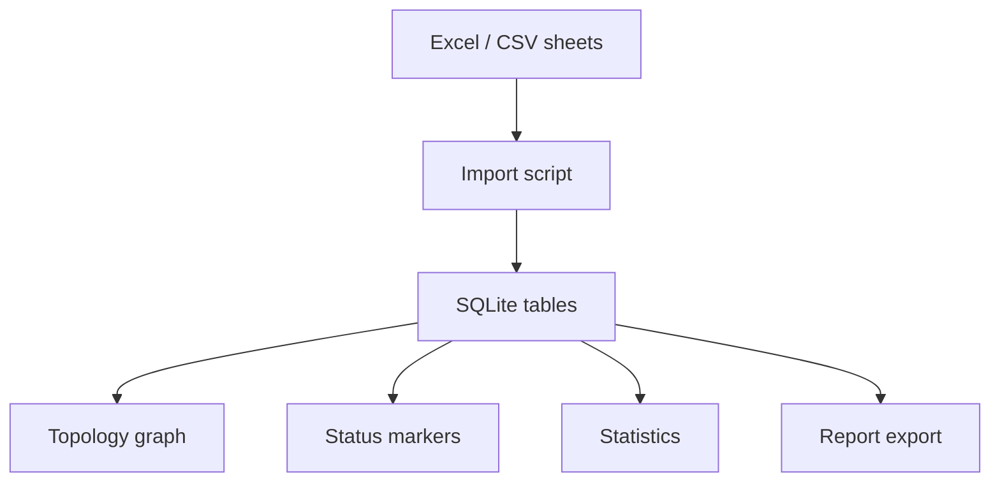

# Data Visualization Management Platform Starter

这个 repo 记录的是一类很常见的 To B 数据可视化管理平台：Excel 表进来，结构化入库，页面上展示关系图/拓扑图、状态标记、统计分析，最后还能导出报表。

我做类似项目时，真正有价值的地方不在某个业务名词，而在这条链路怎么打通：

```text
Excel sheets -> SQLite tables -> relationship graph -> status rules -> statistics -> report export
```

[运行项目](#-运行项目) · [Excel 入库](docs/05-excel-to-db.md) · [可复用模式](docs/04-reusable-patterns.md) · [验收清单](docs/03-validation-loop.md)


## 🚀 运行项目

前端 demo：

```bash
npm install
npm run dev
```

浏览器打开：

```text
http://localhost:5173
```

导入示例 Excel 表结构，并导出统计报表：

```bash
npm run import:demo
npm run export:report
```

构建和数据合同检查：

```bash
npm run build
npm run check:contract
```

## 可以直接拿走什么

```text
examples/excel-sheets/
  assets.csv      资产/节点表
  links.csv       关系/拓扑边表
  services.csv    业务映射表
  alerts.csv      状态/告警表

scripts/
  import_demo_data.py   CSV 表入 SQLite
  export_report.py      从 SQLite 导出统计和报表 CSV
  check-contract.mjs    检查前端 mock 合同是否断链

docs/sql/
  schema.sql            数据库表结构

src/
  opsPatterns.ts        场景、健康度、报表可信度、合同检查
  main.tsx              可运行的数据可视化界面
```

如果你手里是 `.xlsx`，可以把每个 sheet 另存为 CSV 来跑这套 demo；真实项目里再换成 `openpyxl`、`pandas` 或后端上传接口。

## 我想分享的几个经验

### 1. Excel 导入前先定数据合同

这类平台最容易卡在字段口径。页面要画关系图，就必须提前明确：

- 哪张表是节点。
- 哪张表是边。
- 边的 `source` / `target` 怎么对应节点 ID。
- 状态字段来自节点、边、告警，还是计算规则。
- 报表统计以数据库为准，还是以前端筛选结果为准。

这个 repo 里用四张表表达最小合同：

```text
assets.csv   节点
links.csv    关系边
services.csv 业务映射
alerts.csv   状态事件
```

### 2. 关系图一定要能回到原始表

关系图/拓扑图好看不够，点击一个点或一条边时，最好能追到来源表里的 ID、状态、负载、业务和告警。

我在 demo 里保留了 `link_id`、`source_asset_id`、`target_asset_id` 这类字段。它们看起来普通，但后面做路径追踪、状态解释、报表导出都靠这些字段串起来。

### 3. 状态标记要有统一来源

节点状态、边状态、告警等级如果各算各的，页面很快会互相打架。

更稳的做法是让状态来源固定：

- `assets.status` 表示节点当前状态。
- `links.status` 表示关系/链路当前状态。
- `alerts.level` 表示事件等级。
- 健康度和报表可信度从这些结构汇总出来。

这样地图、逻辑拓扑、统计卡片和报表能讲同一套话。

### 4. 报表导出要从数据库走

很多 demo 会让前端表格看起来能导出，但真正交付时，报表应该从结构化数据层生成。这样导出的统计、状态、拓扑关系才能回查。

这个 repo 的导出脚本会生成：

```text
output/report/summary.json
output/report/status_by_region.csv
output/report/topology_report.csv
output/report/alert_report.csv
```

这就是一个很小的报表中心雏形。

## 数据流



## 可以怎么改

- 把 `examples/excel-sheets/*.csv` 换成自己的 Excel sheet 导出。
- 在 `docs/sql/schema.sql` 里增加字段和表。
- 把 `scripts/import_demo_data.py` 改成直接读 `.xlsx`。
- 把前端关系图换成 Cytoscape、D3 或 ECharts graph。
- 把 `output/report/*.csv` 换成 Excel 多 sheet 导出。

## License

MIT
